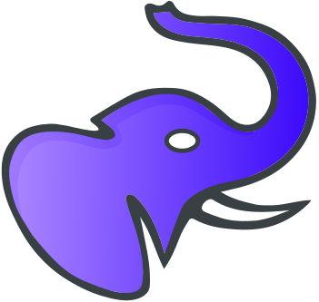

<p align="center">
  
</p>
# DosiusSmart

**Intelligent glycemic management system for insulin-dependent diabetics.**

Final Degree Project (Trabajo de Fin de Grado) — Software Engineering, Universidad de Sevilla.

> **Status: Active development.** The full decision-support engine (IOB/COB physics, glucose forecasting, per-event Bayesian learning of ISF/ICR/basal, contamination detection) is implemented and functional. Statistics and meal-photo recognition remain planned.

---

## Overview

DosiusSmart is an Android application that centralises the daily management of Type 1 (and insulin-dependent Type 2) diabetes. It pulls continuous glucose monitor (CGM) data from Abbott LibreLinkUp, lets users log food, insulin, and exercise events, and provides physiology-based insulin and carbohydrate recommendations that adapt to each user over time. It is a decision-support tool, not a closed-loop system: the user retains full control and every recommendation carries an explicit confidence level.

The application is being developed as a TFG at the University of Seville, focusing on integrating real medical data pipelines with a clean, modern Android architecture.

---

## Features

### Implemented

| Feature | Description |
|---|---|
| **Live glucose dashboard** | Current reading from Abbott LibreLinkUp, colour-coded by range, with trend arrows, 6h Vico chart, and entry history grouped by day |
| **Foreground glucose sync** | Foreground service polls readings every 5 min, updates a persistent notification, and runs alarm checks |
| **Hypo / hyper alarms** | Configurable thresholds with DnD-bypassing alerts and a state machine that prevents re-firing until glucose recovers |
| **Insulin & carb recommendations** | Prandial bolus, hyper/hypo correction, and pre-exercise carbs from an IOB/COB physiology engine, each with a confidence level |
| **Glucose forecasting** | 4-hour, 4-component forecast (insulin, carbs, momentum, retrospective correction) overlaid on the chart |
| **Per-event Bayesian learning** | ISF (per correction), ICR (per meal), and basal (per sleep window) learned on-device via conjugate Gaussian updates with safety guardrails |
| **Contamination detection** | Excludes hypo, exercise, statistical-outlier, and unannounced-meal windows from learning (OpenAPS oref1 inspired) |
| **Therapy parameters screen** | 24-hour ISF/ICR/target/basal table with suggested posteriors (mean ± σ) and an Accept-All gate with guardrail clamping |
| **Food database** | Full CRUD with nutritional data (carbs/100 g, glycaemic index, ingredients), hierarchical categories, search, and personal posterior learning |
| **Exercise database** | Exercise types with expected glucose drop per hour and learned confidence |
| **Quick entry** | Log food, insulin, exercise, or a sleep window from a single sheet, with opt-in toggles for ISF/ICR/basal learning |
| **Onboarding** | 3-step flow (terms, LibreLinkUp connection, initial therapy parameters) gated on first launch |
| **Logs screen** | Full entry log viewer |
| **Settings screen** | LibreLinkUp credentials storage via DataStore |

### Planned / In Progress

- **Statistics screen** time-in-range, HbA1c estimate, trend analysis over configurable periods (placeholder)
- **AI screen** route exists but renders a "coming soon" placeholder
- **Meal recognition** photo-based carbohydrate estimation
- **Autosens** ratio is computed and stored but not yet applied to ISF/ICR lookups

---

## Architecture

The project follows **MVVM** with a strict three-layer structure:

```
presentation/   Compose screens, ViewModels, UiState, navigation, theme
domain/         Data models (@Entity), repository interface, and the DSS engine
                (physiology, learning, recommendation, food resolution, contamination)
data/           Repository implementations, DAOs, Room DB, Retrofit API,
                foreground service, learning workers, DI modules
```

Key architectural decisions made deliberately for this project scope:

- **Pure domain engines.** The DSS math (IOB/COB, forecasting, Bayesian fitting, carb inference) lives in framework-free engine classes under `domain/engine/`. Workers and repositories in the data layer are thin orchestrators that fetch rows, call an engine, and persist the result.
- **No separate entity classes.** Domain models carry `@Entity` annotations directly; `Converters.kt` handles complex types.
- **No use case layer.** ViewModels call repositories directly.
- **Repository interface only for `GlucoseRepository`,** because it has two implementations (`LibreLinkUpRepository` + `MockGlucoseRepository`). All other repositories are concrete classes injected directly.
- **On-device only.** All health data and recommendations stay on the device (NFR-0007); the app remains functional offline.

---

## Tech Stack

| Category | Library / Tool |
|---|---|
| Language | Kotlin 2.0.21 |
| UI | Jetpack Compose + Material 3 |
| Architecture | MVVM, Kotlin Coroutines, StateFlow |
| Dependency injection | Hilt 2.51.1 (KSP) |
| Local persistence | Room 2.6.1 (schema v13) |
| Network | Retrofit 2 + OkHttp + Kotlinx Serialization |
| Charts | Vico `compose-m3:2.0.0` |
| Background work | Foreground service (5-min polling) + WorkManager 2.9.1 (per-event learning workers) |
| Date/time | `kotlinx-datetime:0.6.1` |
| Credential storage | DataStore Preferences (credentials, app, alarms) |
| Min SDK | 26 (Android 8.0) |
| Target / Compile SDK | 36 |

---

## Project Structure

```
app/src/main/java/com/dosius/smart/
├── domain/
│   ├── engine/
│   │   ├── physiology/     # IOBCalculator, COBCalculator, GlucosePredictor,
│   │   │                   #   GlucoseForecaster, DeviationCalculator
│   │   ├── learning/       # BayesianParameterFitter, MealCarbInferenceEngine,
│   │   │                   #   ExerciseDropEngine
│   │   ├── recommendation/ # RecommendationEngine
│   │   ├── food/           # FoodResolutionEngine
│   │   └── contamination/  # ContaminationDetectionEngine
│   ├── model/              # GlucoseReading, Entry, Food, Exercise, TherapyParameter,
│   │                       #   DeviationPoint, FoodCase, ContaminationWindow, Forecast ...
│   └── repository/         # GlucoseRepository interface
├── data/
│   ├── di/                 # DatabaseModule, NetworkModule, RepositoryModule
│   ├── local/
│   │   ├── dao/            # EntryDao, GlucoseReadingDao, TherapyParameterDao,
│   │   │                   #   DeviationPointDao, FoodCaseDao, ContaminationWindowDao ...
│   │   └── database/       # DosiusDatabase (v13), Converters
│   ├── preferences/        # CredentialPreferences, AppPreferences, AlarmPreferences
│   ├── remote/             # LibreLinkUpApi, DTOs, GlucoseReadingMapper
│   ├── repository/         # LibreLinkUpRepository, MockGlucoseRepository, EntryRepository,
│   │                       #   ContaminationRepository, DeviationRepository, ForecastRepository ...
│   ├── alarm/              # GlucoseAlarmChecker
│   ├── service/            # GlucoseRefreshService (foreground)
│   └── worker/             # IsfLearningWorker, MealEventWorker, ExerciseEventWorker,
│                           #   BasalLearningWorker, GlucoseRefreshWorker
└── presentation/
    ├── navigation/         # AppNavHost, Screen (sealed class)
    ├── onboarding/         # OnboardingScreen + ViewModel
    ├── dashboard/          # DashboardScreen + ViewModel
    ├── entry/              # QuickEntrySheet, AddEntryViewModel
    ├── parameters/         # TherapyParametersScreen + ViewModel
    ├── database/           # Food + Exercise tabs, detail screens + ViewModels
    ├── logs/               # LogsScreen + ViewModel
    ├── alarm/              # AlarmScreen + ViewModel
    ├── settings/           # SettingsScreen + ViewModel
    └── theme/              # Color, Type, Theme
```

---

## Getting Started

### Prerequisites

- Android Studio Hedgehog or later
- JDK 17
- A LibreLinkUp account linked to a FreeStyle Libre sensor (optional — the app falls back to mock data)

### Running the app

1. Clone the repository.
2. Open the project in Android Studio.
3. Let Gradle sync complete.
4. Run on an emulator (API 26+) or a physical device.

To use live CGM data, enter your LibreLinkUp email and password in the **Settings** screen. The app will authenticate and begin syncing readings automatically.

Without credentials the app displays mock glucose data so the UI can be explored without hardware.

---

## CGM Integration

DosiusSmart connects to **Abbott's LibreLinkUp API** (`api.libreview.io`) — the same backend used by the official LibreLinkUp companion app. Authentication uses email/password; the session token is stored encrypted in DataStore. Readings are cached in Room so the dashboard remains functional offline.

> This integration is unofficial and not affiliated with Abbott Diabetes Care.

---

## Roadmap

```
[x] Glucose dashboard + LibreLinkUp integration
[x] Foreground glucose sync + hypo/hyper alert notifications
[x] Food + exercise databases (CRUD)
[x] Diary entry logging (food, insulin, exercise, sleep)
[x] IOB/COB physiology engine + glucose forecasting
[x] Insulin & carb recommendation engine
[x] Per-event Bayesian learning (ISF, ICR, basal) + contamination detection
[x] Onboarding flow
[ ] Statistics & time-in-range analysis
[ ] Meal photo recognition
[ ] Apply autosens to recommendations
[ ] Polish & accessibility pass
```

---

## Academic Context

This project is submitted as the Final Degree Project (TFG) for the Software Engineering degree at the **Universidad de Sevilla**. It is a solo development project built incrementally over the course of one academic year.

The technical scope covers:

- Integration with a real-world continuous glucose monitor data pipeline
- Local-first, on-device persistence and computation with offline support
- Modern Android architecture patterns (MVVM, Clean Architecture, Compose, Hilt, Coroutines)
- A physiology-based decision-support engine with per-event Bayesian parameter learning

---

## License

This project is developed for academic purposes. All rights reserved.
